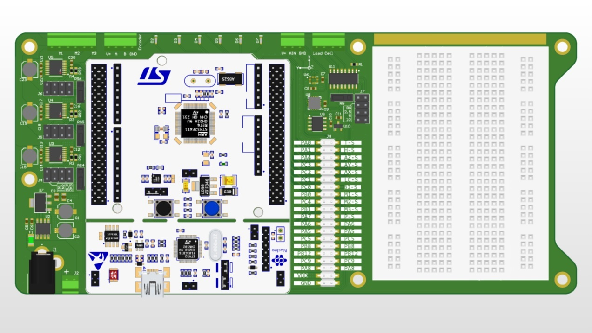
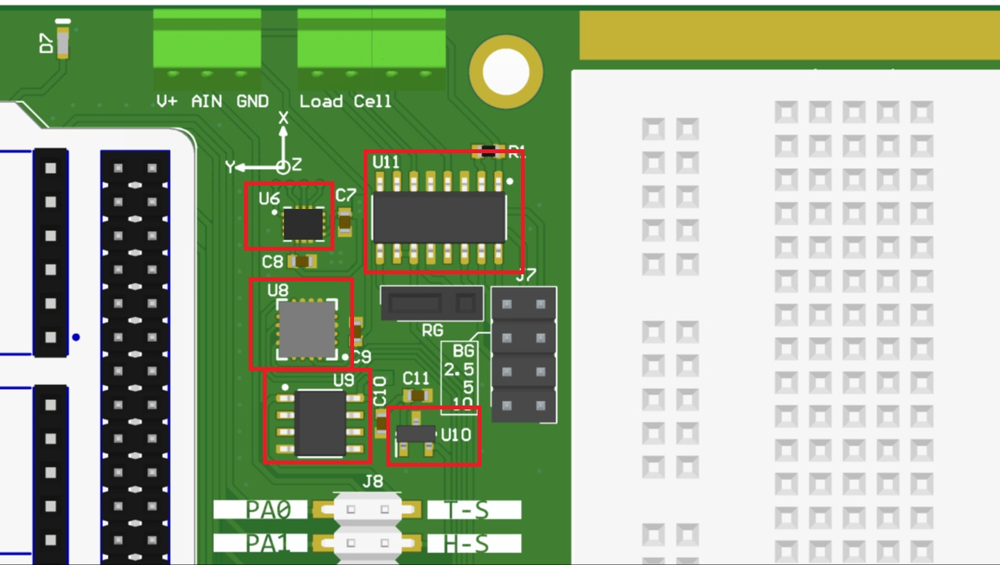
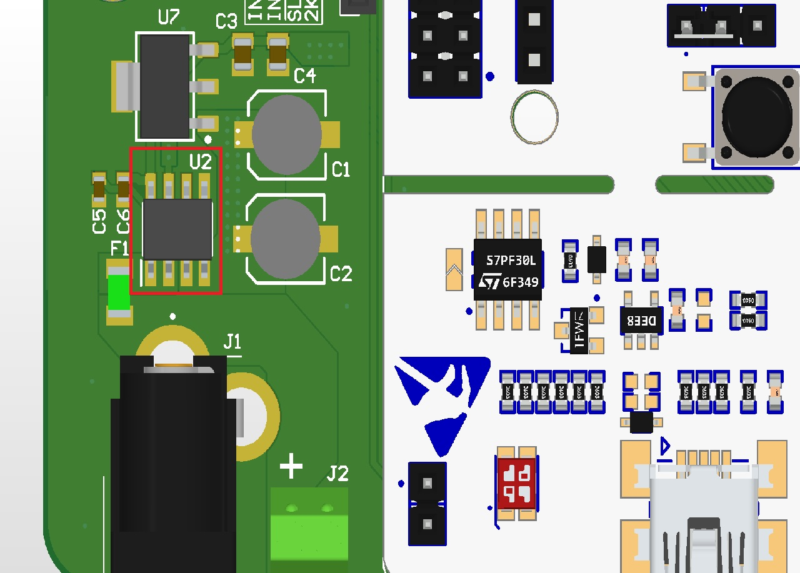
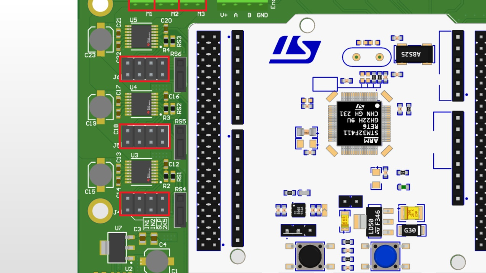
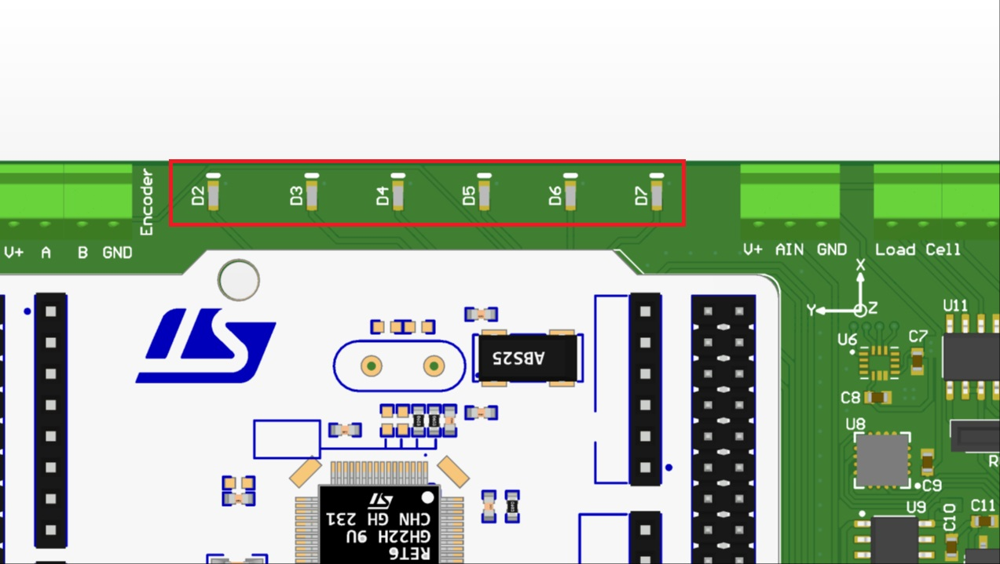

### Top View of the RMXplorer

## On Board Features

* Nucleo F411RE 
    * [Nucleo F411RE on Mbed website](https://os.mbed.com/platforms/ST-Nucleo-F411RE/)
    * [STM32F411RET6 microcontroller](https://github.com/pokpongc/rmxplorer_A/blob/master/datasheet/stm32f411xx.pdf)

1. **U8**: Analog Accelerometer ([ADXL335](https://github.com/pokpongc/rmxplorer_A/blob/master/datasheet/adxl335_analog_3axis_accelerometer.pdf))
2. **U2**: Current Sensor ([ACS712](https://github.com/pokpongc/rmxplorer_A/blob/master/datasheet/acs712_current_sensor.pdf))
3. **U6**: Digital Gyroscope ([BMG250](https://github.com/pokpongc/rmxplorer_A/blob/master/datasheet/bmg250_digital_gyroscope.pdf))
4. **U10**: 1D Hall Effect Sensor ([DRV5055Z4](https://github.com/pokpongc/rmxplorer_A/blob/master/datasheet/drv5055z4_linear_hall-effect_sensor.pdf))
5. **U3, U4, U5**: 3 H-Bridges ([DRV8876](https://github.com/pokpongc/rmxplorer_A/blob/master/datasheet/drv8876_current_sense_h-bridge.pdf))
6. **D2-D7**: LEDs ([HSMG_C190](https://github.com/pokpongc/rmxplorer_A/blob/master/datasheet/hsmg_c190_onboard_led.pdf))
7. **U9**: Centigrade Temperature Sensor ([LM35](https://github.com/pokpongc/rmxplorer_A/blob/master/datasheet/lm35dmx_temperature_sensor.pdf))
8. **U11**: Instrumentation Amplifier ([INA125](https://github.com/pokpongc/rmxplorer_A/blob/master/datasheet/ina125_analog_loadcell_amplifier.pdf))

## Important Notes

### Using RMXplorer _with_ 24VDC Adapter
* Before plugging in the adapter, _move **JP5** to **E5V**_ (on the Nucleo board).

### Using RMXplorer _without_ 24VDC Adapter
* _Move **JP5** to **U5V**_ (on the Nucleo board).

## Default Pin Map
### J8

STM32 Pin | Peripheral | Component Pin
------------ | ------------- | -------------
PA_0 | ADC1/0 | T-S (Temperature Sensor)
PA_1 | ADC1/1 | H-S (Hall Effect Sensor)
PA_4 | ADC1/4 | AZ-S (Z-Axis Accelerometer Output)
PC_3 | ADC1/13 | AY-S (Y-Axis Accelerometer Output)
PC_2 | ADC1/12 | AX-S (X-Axis Accelerometer Output)
PC_1 | ADC1/11 | LC-S (Instrumental Amplifier)
PC_0 | ADC1/10 | BI-S (On Board Current Sensor)
PB_0 | ADC1/8 | M1-S (M1 Current Feedback)
PC_4 | ADC1/14 | M2-S (M2 Current Feedback)
PB_1 | ADC1/9 | M3-S (M3 Current Feedback)
PA_7 | ADC1/7 | P-S (Potentiometer Output)
PA_6 | ADC1/6 | NC
PA_5 | ADC1/5 | NC
PC_5 | ADC1/15 | NC
PB_8 | I2C1_SCL | NC
PB_12 | I2C1_SDA | NC
PC_9 | - | NC
PA_8 | PWM1/1 | NC
VDD | - | NC
GND | - | NC

### J4-J6 H-Bridge Configuration Pin

#### J4
STM32 Pin | Peripheral | DRV8876 Pin
------------ | ------------- | -------------
PC_8 | PWM3/3 | 1 (EN/IN1) of M1
PC_6 | PWM3/1 | 2 (PH/IN2) of M1
PA_12 | - | 3 (nSLEEP) of M1
2.5K Default Resistor | - | 6 (IRPOPI) of M1

#### J5
STM32 Pin | Peripheral | DRV8876 Pin
------------ | ------------- | -------------
PA_11 | PWM1/4 | 1 (EN/IN1) of M2
PC_7 | PWM3/2 | 2 (PH/IN2) of M2
PB_2 | - | 3 (nSLEEP) of M2
2.5K Default Resistor | - | 6 (IRPOPI) of M2

#### J6
STM32 Pin | Peripheral | DRV8876 Pin
------------ | ------------- | -------------
PA_9 | PWM1/2 | 1 (EN/IN1) of M3
PB_10 | PWM2/3 | 2 (PH/IN2) of M3
PB_15 | - | 3 (nSLEEP) of M3
2.5K Default Resistor | - | 6 (IRPOPI) of M3

### LEDs

STM32 Pin | LED's Designator
------------ | -------------
PB_14 | D2
PA_13 | D3
PA_14 | D4
PC_13 | D5
PC_14 | D6
PC_15 | D7
